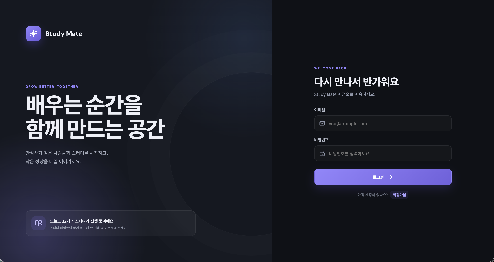
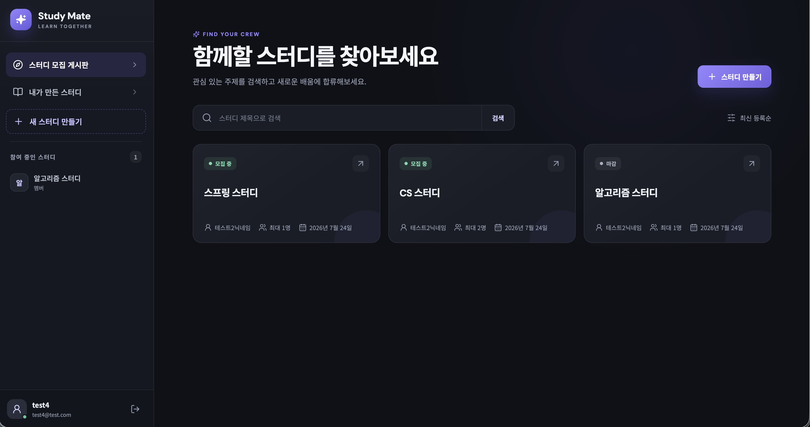
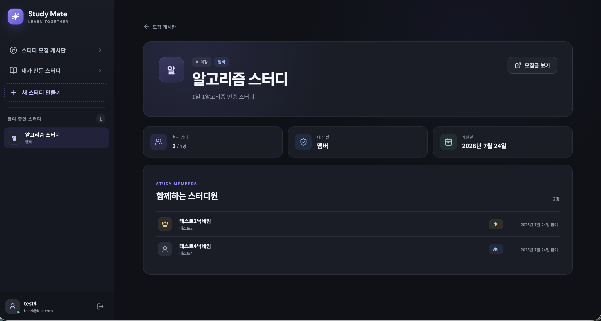
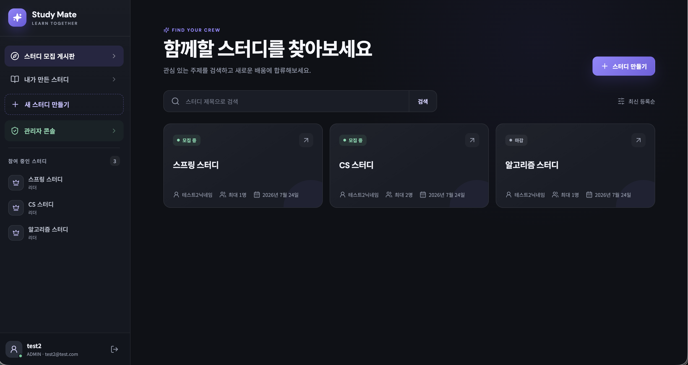
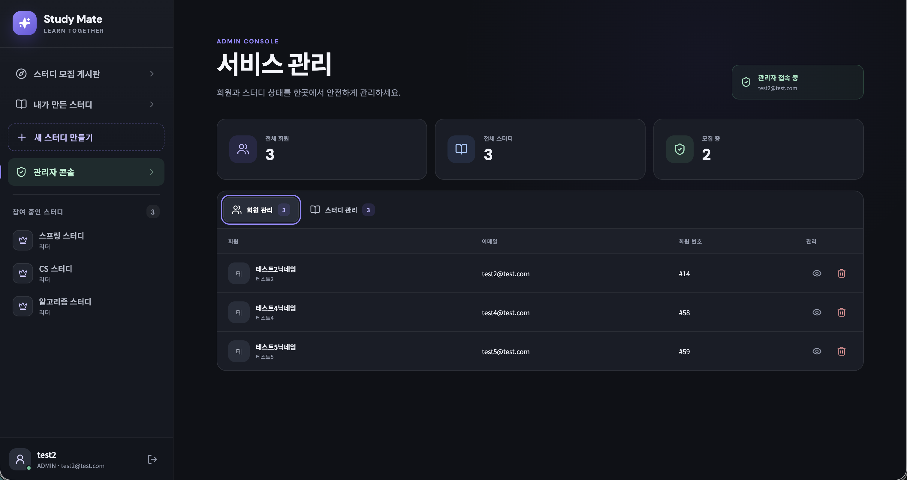

# Study Mate (스터디 메이트) 미니 프로젝트

스터디원들을 모집하고, 가입 신청을 받고, 멤버들을 관리할 수 있는 스터디 매칭 백엔드 서비스입니다.

## 1. 개발 환경
### Backend
- Java 21
- Spring Boot
- Spring Data JPA
- Spring Security
- JWT
- Gradle

### Frontend
- React
- Vite
- JavaScript
- React Router
- Axios

### Database
- MySQL

### Development Tools
- STS (Spring Tools for Eclipse)
- MySQL Workbench
- Postman
- Git / GitHub

## 2. 주요 기능

### 회원 관리 및 로그인 (Member/Security)
- JWT를 사용해서 로그인 기능을 만들었습니다.
- 보안을 위해서 Access Token(3시간)과 Refresh Token(7일)을 나누어 발급합니다.
- Refresh Token은 DB에 저장해두고, Access Token이 만료되면 갱신해줍니다.
- 일반 사용자와 관리자(Admin) 권한을 나누어서, 관리자는 필요할경우 유저를 강제 탈퇴시킬 수 있습니다.

### 스터디 모집 기능 (Study)
- 새로운 스터디를 만들고 제목, 내용, 모집 인원을 설정할 수 있습니다.
- 스터디 목록을 조회할 수 있습니다.
- 스터디 방장(LEADER)과 일반 팀원(MEMBER)의 역할을 분리했습니다.

### 스터디 가입 신청 (Application)
- 사용자가 스터디에 가입 신청을 할 수 있습니다.
- 방장이 신청 목록을 보고 승인하거나 거절할 수 있습니다.

### 마이페이지 기능 (My Page)
- 내가 만든 스터디나 참여 중인 스터디 목록을 확인할 수 있습니다.

## 3. 구현 화면

### 로그인 전 메인 화면

서비스 소개를 확인하고 로그인하거나 회원가입 화면으로 이동할 수 있습니다.



### 일반회원 로그인 화면

스터디 모집 게시판을 조회하고, 참여 중인 스터디와 내가 만든 스터디로 이동할 수 있습니다.



### 참여 중인 스터디 상세 화면

스터디 정보와 목표, 현재 참여자 및 각 참여자의 역할을 확인할 수 있습니다.



### 관리자 로그인 화면

일반회원 기능과 함께 관리자 전용 콘솔 메뉴를 사용할 수 있습니다.



### 관리자 페이지

전체 회원과 스터디 현황을 확인하고 회원 및 스터디를 관리할 수 있습니다.



## 4. 데이터베이스(DB) 테이블 구조

| 테이블명 | 설명 |
| :--- | :--- |
| `role` | 회원 권한 정보 (USER, ADMIN) |
| `member` | 회원 기본 정보 (이메일, 비밀번호, 닉네임 등) |
| `member_role` | 회원과 권한을 연결해주는 다대다(N:M) 매핑 테이블 |
| `refresh_token` | 사용자의 JWT 리프레시 토큰을 저장하는 테이블 |
| `study` | 개설된 스터디 정보 (제목, 내용, 모집 인원 등) |
| `study_application` | 사용자의 스터디 가입 신청 내역 |
| `study_member` | 가입이 최종 승인된 스터디 멤버 목록 |

## 5. 프로젝트 폴더 구조
```text
src
 ├── main
 │    └── java
 │         └── com.example.studymate
 │              ├── admin       // 관리자(Admin) 전용 기능 관리
 │              ├── application // 스터디 가입 신청(신청, 승인, 거절) 관리
 │              ├── config      // Spring Security 및 전역(Global) 설정 파일
 │              ├── member      // 회원 가입, 로그인, 리프레시 토큰 등 회원 도메인
 │              ├── mypage      // 마이페이지 (내 스터디 현황 등) 관리
 │              ├── security    // JWT 토큰 처리, 인증 필터 등 시큐리티 코어 로직
 │              └── study       // 스터디 모집글 작성, 조회, 스터디 멤버 등 관리
```

## 6. API 명세서

<details>
<summary><b> 전체 API 목록 펼쳐보기</b></summary>
<div markdown="1">

| 기능 | Method | Endpoint |
| :--- | :---: | :--- |
| **회원가입** | `POST` | `/members/register` |
| **로그인** | `POST` | `/members/login` |
| **Access Token 재발급** | `POST` | `/members/refresh` |
| **회원 탈퇴** | `DELETE` | `/members/withdraw` |
| **회원가입 페이지** | `GET` | `/pages/register` |
| **로그인 페이지** | `GET` | `/pages/login` |
| **스터디 목록 / 검색 / 페이징** | `GET` | `/studies` |
| **스터디 상세조회** | `GET` | `/studies/{studyId}` |
| **스터디 생성** | `POST` | `/studies` |
| **스터디 수정** | `PUT` | `/studies/{studyId}` |
| **스터디 삭제** | `DELETE` | `/studies/{studyId}` |
| **스터디 참여 신청** | `POST` | `/studies/{studyId}/applications` |
| **스터디 참여 취소** | `DELETE` | `/studies/{studyId}/applications` |
| **내가 참여 중인 스터디 목록** | `GET` | `/my/applications` |
| **내가 만든 스터디 목록** | `GET` | `/my/studies` |
| **전체 회원 조회 (Admin)** | `GET` | `/admin/members` |
| **회원 상세조회 (Admin)** | `GET` | `/admin/members/{memberId}` |
| **회원 강제 삭제 (Admin)** | `DELETE`| `/admin/members/{memberId}` |
| **전체 스터디 조회 (Admin)** | `GET` | `/admin/studies` |
| **스터디 강제 삭제 (Admin)** | `DELETE`| `/admin/studies/{studyId}` |
| **스터디 상태 변경 (Admin)** | `PATCH` | `/admin/studies/{studyId}/status` |

</div>
</details>

## 7. 테스트 실행 방법

1. 프로젝트 디벨로프 브랜치 클론

git clone -b develop --single-branch https://github.com/shin838/study-mate-miniproject.git

2. DB 설정
MySQL에 접속해서 데이터베이스를 만들고, application-local.properties.example 파일을 복사해서 application-local.properties 로컬 설정 파일을 만든 뒤 아이디와 비밀번호를 맞게 수정해줍니다.
